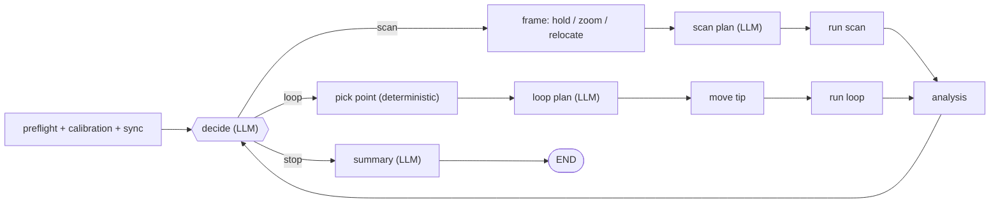

# SPM_agent_simple

A minimal agentic system for autonomous PFM (piezoresponse force microscopy)
experiments on an Asylum Research AFM. Built on LangGraph. The design rule
throughout: an LLM decides *what* to measure next — scan, hysteresis loop, or
stop — while everything numeric (image processing, importance maps, point
picking, loop parameter extraction) stays deterministic. Each LLM contribution
is therefore separable and can be benchmarked on its own. Pixel arrays never
enter LLM context.

## How it works



Each decision names an action; for a loop it also names a target criterion and
a strategy (max / min / diverse). That is the whole steering act — the decision
never proposes a pixel or a frame center.

**Analysis** (per measurement, one subgraph):

- *image*: channel recommendation (LLM, structured) → importance-map agent
  writes scoring code in an isolated Python sandbox. Deliverables are
  per-criterion maps in 0..1 plus a separate safety map ("is this pixel
  measurable"); the final map is plain arithmetic, no weights.
- *loop*: SS-PFM on/off segmentation → hysteresis parameter extraction
  (deterministic) → loop review (LLM vision QC).

**Point picking** is fully deterministic: criterion map × strategy score ×
safety × a spatial penalty around already-measured points, with the frame edge
masked off. Every pick is logged to `decisions/.../pick.json` and is
reproducible from the archived maps alone.

The decision node sees a deterministic text+image digest of everything measured
so far; all results accumulate as append-only records under the run folder.

## Install

```bash
git clone https://github.com/Slautin/SPM_agent_simple.git
cd SPM_agent_simple
python -m venv .venv && source .venv/bin/activate   # Windows: .venv\Scripts\activate
pip install -e .
python -m spm_agent.sandbox        # one-time: build the sandbox for LLM-generated code
```

Create `.env` with `ANTHROPIC_API_KEY` (and `OPENAI_API_KEY` if you switch the
channel model back). Set the instrument MCP URL in `src/spm_agent/config.py`
(`SPM_MCP_SERVER_CONFIG`). Scan, loop, and picker bounds live in the same file.

## Running an experiment

The entry point is `notebooks/16_scan_decide.ipynb`:

```python
EXPERIMENT_TASKS   = ["Determine how local domain structure affects polarization switching dynamics."]
EXPERIMENT_CONTEXT = "DART PFM ... sample description ..."

new_run("my_experiment_tag")
res = await fin_gr.ainvoke(
    {"experiment_tasks": EXPERIMENT_TASKS, "experiment_context": EXPERIMENT_CONTEXT})
```

Everything the run produces lands in `src/runs/<timestamp>_<tag>/`:
`records/` (one JSON per measurement), `decisions/` (digest, decision, pick),
`importance/` (maps + the generated scoring code), `loops/` (data + annotated
figures), `summary/`. A run can be re-analysed offline from this folder alone.

## Repository layout

```
src/spm_agent/
├── config.py           # models, bounds, caps, run directories, MCP config
├── sandbox.py          # isolated venv for LLM-generated code
├── graphs/             # analysis graph (image / loop branches)
├── nodes/              # one LangGraph node per file
├── prompts/ schemas/   # prompt builders, Pydantic contracts
├── states/ tools/ utils/ mcp/
notebooks/              # development history; 16 = the full experiment loop
```

## Status

The full closed loop runs on the instrument: scans, LLM decisions, loop
measurements at deterministically picked points, and an agent-initiated stop
with a validated summary. A complete PLZT campaign (13 loops, 15 decisions)
has been run and audited end-to-end.

Known limitations: the decision digest reports per-criterion sampling but not
joint criterion occupancy, so a criterion combination with no measurable pixels
can be chased; the picker has no tie-breaking on flat score plateaus; the
top-level graph still lives in the notebook rather than `src/`.
