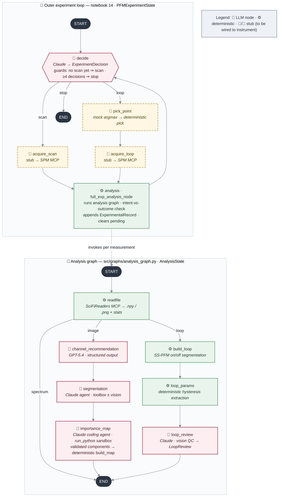

# SPM_agent_simple — System Technical Report

**Date:** 2026-07-16 · **Branch:** `master` (HEAD `9a0927a decision_node_00`) · **Package:** `spm-agent 0.1.0`

A simple agentic system that runs an autonomous PFM (Piezoresponse Force Microscopy) experiment on a scanning probe microscope: acquire a scan → analyze it → decide where to measure hysteresis loops → measure → analyze → decide again → stop. Built on LangGraph, designed so every LLM decision is separable from deterministic code for benchmarking.

---

## 1. Stack

| Layer | Choice |
|---|---|
| Orchestration | LangGraph 1.2.2 (nested StateGraphs, async nodes) |
| LLM (analysis/decision agents) | `claude-sonnet-4-6` via `langchain-anthropic` (`SEG_MODEL`, temp 0, 4096 max tokens) |
| LLM (channel recommendation) | `gpt-5.4` via `langchain-openai` (temp 0, structured output) |
| File reading | SciFiReaders MCP server (stdio), tool `read_scifireaders_file` — reads Igor `.ibw` etc. |
| Microscope control | External SPM MCP server, streamable-http at `http://10.128.35.95:8000/mcp` (instrument PC) |
| Code execution | Isolated Python venv sandbox (`~/.spm_agent/sandbox`): numpy, scipy, scikit-image, matplotlib only |
| Data contracts | Pydantic v2 frozen models + TypedDict states |
| Python | ≥ 3.10 |

## 2. Repository layout

```
src/spm_agent/
├── config.py                 # models, dirs, caps, MCP configs, run-dir factory
├── sandbox.py                # isolated venv provisioning + isolation self-check
├── graphs/analysis_graph.py  # the (sub)graph that analyzes one measurement file
├── nodes/                    # 13 LangGraph nodes (one file each)
├── prompts/                  # 5 prompt builders (one per LLM node)
├── schemas/                  # 7 Pydantic contracts (structured outputs + instrument)
├── states/                   # AnalysisState, PFMExperimentState (TypedDicts)
├── tools/                    # run_python sandbox tool; segmentation toolbox
├── utils/                    # deterministic math: loops, digest, map building, I/O
└── mcp/                      # SciFiReaders client, SPM MCP client
notebooks/0..14               # development history; 14 = current top-level experiment graph
src/runs/<YYYYMMDD_HHMMSS>/   # per-run artifacts (segmentation, importance, loops, decisions)
```

The **top-level experiment graph is currently wired in `notebooks/14_analysis_graph_and_decision.ipynb`**, not yet in `src/`. Everything it uses (nodes, states, schemas) lives in the package.

## 3. Architecture



### 3.1 Outer experiment loop (notebook 14, state = `PFMExperimentState`)

- `decide` = `experiment_decision_node` — Claude with structured output `ExperimentDecision` (`understanding`, `open_questions`, `action: loop|scan|stop`, `target_criterion`, `reasoning`). Two deterministic guards bypass the LLM: no scan yet → forced `"scan"`; `len(decisions) ≥ MAX_TOTAL_DECISIONS` (=4) → forced `"stop"`. Raises if a `pending` measurement is still in flight.
- Its input is a **deterministic multimodal digest** (`build_decision_digest`): per scan — importance criteria (names/weights/rationale) and segmentation summary; per loop — pixel location, per-criterion importance at that pixel (3-px patch mean), extracted parameters, quality review, interpretation; plus two images: importance map with numbered measured points and a loop gallery. Digest text + `decision.json` archived under `runs/.../decisions/decision_NN/`.
- `pick_point` — currently a **mock**: argmax of importance map 0. Planned: deterministic pick with spatial penalty (see §8).
- `acquire_scan` / `acquire_loop` — currently **stubs returning fixed `.ibw` files** (PLZT scan / PLZT loop). Will call the SPM MCP server.
- `analysis` = `full_exp_analysis_node` — invokes the compiled analysis graph on `pending.file_path`, verifies intent vs outcome (`scan`→`image`, `loop`→`loop`, fails loudly on mismatch), packs the result + instrument snapshot into an append-only `ExperimentalRecord`, assigns `scan_index` (loops inherit parent scan's index and get `pixel_yx`), clears `pending`.
- Run invoked with `recursion_limit=60` (~15 cycles; mechanical brake independent of the semantic `MAX_TOTAL_DECISIONS` cap).

### 3.2 Analysis graph (`graphs/analysis_graph.py`, state = `AnalysisState`)

`readfile_node` reads the file through the SciFiReaders MCP, saves every channel as `.npy` + `.png` preview into `.cashe/current/`, computes stats (min/max/mean/std/p01/p99), patches a known SciFiReaders units bug (`fix_units`), and classifies the measurement (`classify_measurement`: 2-D array → `image`; piecewise-constant alternating on/off Bias waveform with ≥20 segments → `loop`; else `spectrum`).

### 3.3 Image branch

1. **`channel_recommendation_node`** (GPT-5.4, structured output `TaskChannelReccomendationReport`). For 6 fixed task types (domain segmentation, domain-wall segmentation, grain boundary, crack/scratch, contamination, scan artifact) recommends primary/secondary channels with feasibility, confidence, reasoning, warnings. Input: channel metadata, stats, and preview images.
2. **`agentic_segmentation_node`** (Claude tool-use agent, one per feasible recommendation, currently limited to first 2 recs — marked `CHANGE IT LATER`). The agent never sees the pixel array in state; tools close over an in-memory `SegSession` (raw physical values, normalized working image, boolean mask, `ops` log). Toolbox (numbers-only returns): `describe_image`, `smooth_image`, `compute_gradient_magnitude` (Sobel, for walls), `threshold_image` (otsu / percentile / absolute; on normalized work image or raw physical units), `clean_mask` (open/close/dilate/erode), `remove_small_regions`, `mask_summary`, `reset_working_image`. With `SEG_VISION_IN_LOOP=True` a `show_overlay` tool additionally returns the rendered mask overlay as an image (the flag is a clean vision-vs-numbers ablation switch). Budget: `recursion_limit = SEG_MAX_SUPERSTEPS = 30` (~14 tool calls), prompt says "< 12 ops". Output per task: mask `.npy`, overlay `.png`, `n_regions`, `coverage`, the ordered `ops` log (a reproducible "program"), reasoning, and audit fields (`model`, `vision_in_loop`, `n_look`).
3. **`importance_map_node`** (Claude coding agent, one per experiment task). Single tool `run_python`: each call writes `cell.py` into a persistent workdir and executes it in the **isolated sandbox** subprocess (30 s timeout, fresh process per call, state via files); stdout (last 4000 chars) and any new PNGs come back to the model (vision); every figure is archived as `figures_i/stepNN_*.png`. Deliverable contract: `components.npy` — float32 `(K, H, W)`, each slice one scoring criterion in [0,1] on the input pixel grid, K ≤ 6, non-redundant (max pairwise |corr| ≤ 0.95) — and `components.json` (`names`, `weights>0`, `rationale`). Deterministic validation (`validate_components`) with up to `MAX_VALIDATION_RETRIES=2` fresh-start retries (retry prompt points to leftover files in the workdir); hard failure raises. The final **importance map is built deterministically** by `build_map` (normalized weighted sum, scaled 0–100) — the agent's arithmetic is never trusted for the map itself. All agent code cells are concatenated into `scoring_code_N.py` for reproducibility.

### 3.4 Loop branch (SS-PFM / DART)

1. **`build_loop_node`** — deterministic. `segment_sspfm_loops`: finds the Bias channel, run-length-encodes constant-bias segments, drops the first 20 % of each segment (transient), classifies segments on-field vs off-field (off-field inherits the preceding pulse bias), derives quadratures `X = A·cos φ`, `Y = A·sin φ` from Amp/Phase, segment-averages every channel, saves `{ch}_on/off.npy`, `bias_on/off.npy`, and an overview figure.
2. **`loop_params_node`** — deterministic, no LLM. `extract_loop_params` per branch (off/on): PCA quadrature rotation (+ residual QC metric), cycle-averaged rising/falling branches on a 201-point bias grid, branch RMS noise, saturation values (outer 15 % of bias), response offset, coercive voltages (steepest zero crossing per branch), imprint, loop width, remnants at 0 V, loop height, shoelace area/cycle, rotation direction; renders an annotated PNG with all values drawn on the data.
3. **`loop_review_node`** (Claude, structured output `LoopReview`) — vision double-check: are the overlaid markers consistent with the plot; loop quality class (`good|noisy|unsaturated|no_switching|artifact`); `is_ferroelectric_like` (off-field only — on-field may carry electrostatics); issues; 2–4-sentence physical interpretation; confidence.

### 3.5 Instrument-facing nodes (built, not yet in the main graph)

- `scanner_calibration_node` → SPM MCP `pfm_calibrate_xy_frame`; stores one-point LVDT↔frame calibration (`ScannerCalibrations`: offsets + LVDT sensitivities; never rendered into LLM context).
- `microscope_get_status_node` → SPM MCP `pfm_get_experiment_status`; maps raw dict into frozen `InstrumentState` (scan geometry, probe position in frame coordinates via calibration, DART excitation `f1,2 = f ± width/2`, contact feedback setpoint/gain).
- `SPMMCPClient` — thin `MultiServerMCPClient` wrapper with a lazy tool registry.

## 4. State model

- **`AnalysisState`** (per measurement): `file_path`, `file_channels: {id → Channel(title, units, dtype, shape, stats, array_path, preview_path)}`, `kind`; image branch: `channel_recommendations`, `segmentation_results`, `experiment_tasks`, `experiment_context`, `importance_maps`; loop branch: `loops: LoopData`, `loop_params {off_field, on_field}`, `loop_review`.
- **`PFMExperimentState`** (whole experiment): `instrument_state`, `scanner_calibrations`, `experiment_tasks`, `experiment_context`, `experimental_records` (append-only list of `ExperimentalRecord` = AnalysisState + instrument snapshot + `scan_index` [+ `pixel_yx` for loops]), `decision_records`, `pending: PendingMeasurement | None` (kind, pixel, file_path, decision_index — created by decide, filled by acquisition, consumed by analysis).

Key convention: **pixel arrays never enter LLM state** — everything heavy lives on disk as `.npy`/`.png` paths; the LLMs see stats, paths, small JSON, and selected images.

## 5. Data & artifact layout

Each experiment run gets `src/runs/<timestamp>/` (`config.new_run()` / `run_dir()`):

```
segmentation/scan_NN/  <task>_mask.npy, <task>_overlay.png
importance/scan_NN/    components_i.npy/.json, importance_map_i.npy,
                       scoring_code_i.py, figures_i/stepNN_*.png
importance/work/       agent scratch (cell.py, intermediates)
loops/loop_NNN/        {X,Y,Amp,Phase,Freq,bias}_{on,off}.npy,
                       loop_{on,off}_annotated.png, loops_overview.png
decisions/decision_NN/ digest.txt, digest_map.png, digest_loops.png, decision.json
```

Channel cache (per file read): `src/spm_agent/.cashe/current/` (note: "cashe" typo is load-bearing — it's in `config.CASHE_DIR`).

## 6. Safety & robustness mechanisms

| Mechanism | Where | Effect |
|---|---|---|
| Isolated sandbox venv | `sandbox.py` | LLM-generated code cannot import `spm_agent` / reach the microscope; `_assert_isolated` verified on every startup; 30 s per-cell timeout |
| Semantic decision cap | `MAX_TOTAL_DECISIONS=4` | graceful `stop` via deterministic guard |
| Mechanical recursion caps | `recursion_limit`: 60 outer, 30 segmentation, 60 importance | kills miswired/stuck loops with an exception |
| Deliverable validation + retries | `validate_components` | shape/range/finiteness/redundancy gate before anything downstream trusts the agent |
| Deterministic map arithmetic | `build_map` | agent proposes components; the system computes the map |
| Intent-vs-outcome check | `full_exp_analysis_node` | ordered `scan` but got a loop file (or v.v.) → RuntimeError |
| In-flight guard | `decision_node` | decide can't run while `pending` is set |
| Criterion name validation | `resolve_criterion` | fuzzy-matches the decision's `target_criterion` against real component names; falls back to weighted map |

## 7. Determinism map (for benchmarking)

**LLM (5 call sites):** channel recommendation (GPT-5.4, structured), segmentation agent (Claude, tools ± vision), importance-map coding agent (Claude, run_python + vision), loop review (Claude, structured + vision), experiment decision (Claude, structured + vision digest).

**Deterministic (everything else):** file reading/stats, measurement classification, loop segmentation and parameter extraction, components validation, importance-map arithmetic, digest construction, point picking (planned), routing, guards, artifact I/O.

Every LLM step leaves a benchmarkable trace: segmentation `ops` log + coverage/regions, importance `scoring_code_i.py` + step figures + validated components, decision digest + JSON verdict. Ablation switches available today: `SEG_VISION_IN_LOOP` (vision vs numbers-only segmentation), experiment context string (on/off), static vs penalized weights (penalty not yet merged).

## 8. Current status & known gaps

**Working end-to-end (with mocked acquisition):** full cycle decide → (scan|loop) → analysis → decide on real PLZT `.ibw` files; run `20260716_161158` acquired 1 scan + 3 loops (all three LLM decisions chose `loop` targeting `domain_interior`) and ended at the `MAX_TOTAL_DECISIONS=4` safety cap. That all loops chased the same criterion is itself evidence for the missing spatial penalty (§8.2).

Gaps and deliberate deferrals:

1. **Acquisition is stubbed** — `acquire_scan`/`acquire_loop` return fixed files; SPM MCP calls (`move_tip`, scan/loop triggers) not wired in. Calibration/status nodes exist but aren't in the main graph, so `instrument_params` on records is currently `None`.
2. **`pick_point` is a mock argmax** — the designed deterministic pick (spatial penalty around measured points; per-criterion `saturates` flag with `component_penalty(gamma=0.3, w_min=0.05, patch=3)`) was specced in conversation but intentionally deferred per the walking-skeleton rule: static weights first, each feature turned on as a measured ablation.
3. **Top-level graph lives in a notebook**, not in `src/graphs/`.
4. `spectrum` kind dead-ends at END; segmentation runs only on the first 2 recommendations; `.env.example` is empty; `README.md` is empty; retry/error lanes for agent recursion failures are try/except-free (a deep `GraphRecursionError` kills the run).
5. Known LLM-knowledge failure modes found in testing, with agreed prompt-level fixes (not all merged): amplitude is not a quality criterion near 180° walls (amplitude null), require a stated physical mechanism per importance criterion, channel-description knowledge injection.

## 9. Development history

Git: `Initial setup` → SciFiReaders service → channel recommendation → MCP readfile/server → segmentation agent (`6a48b11`, notebook 7) → calibration/status nodes + PFM state (`491b6a5`) → importance map v0/v1 → loop subgraph + loop review → importance components → decision node (`f0098fe`, `9a0927a`, notebook 14). Notebooks 0–14 track the same arc: LangGraph basics → image analysis → microscope control → segmentation → importance maps → loops → full analysis graph + decision loop.
